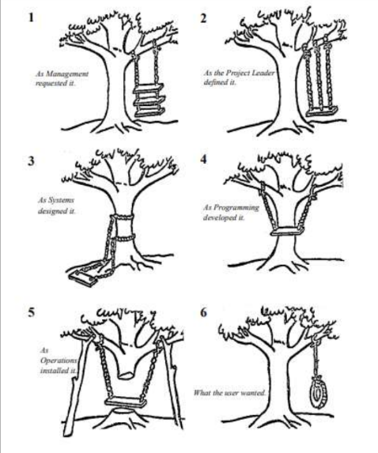

<!-- Link do CSS -->
<link rel="stylesheet" href="../estilos-markdown.css">

<h1 class="les"> Overview </h1>

 1ª vez que o termo Engenharia de Software foi usado 

`Conferência da OTAN (Alemanha, 1968)`.

Comentário de participante da OTAN:
<blockquote class="les"> "Certos sistemas estão colocando demandas que estão além das nossas capacidades... Estamos tendo dificuldades com grandes aplicações." </blockquote>

 O que se estuda em Eng. de Software? 

| V3 (2014) | V4 (2024) |
| - | - |
| Introdução | Introdução |
| 1. Software Requirements | 1. Software Requirements |
| - | 2. Software  |
| 2. Software Design | 3. Software Design |
| 3. Software Construction | 4. Software Construction |
| 4. Software Testing | 5. Software Testing |
| - | 6. Software Engineering Operations |
| 5. Software Maintenance | 7. Software Maintenance |
| 6. Software Configuration Management | 8. Software Configuration Management |
| 7. Software Engineering Management | 9. Software Engineering Management |
| 8. Software Engineering Process | 10. Software Engineering Process |
| 9. Software Engineering Models and Methods | 11. Software Engineering Models and Methods |
| 10. Software Quality | 12. Software Quality |
| - | 13. Software Security |
| 11. Software Engineering Professional Practice | 14. Software Engineering Professional Practice |
| 12. Software Engineering Economics | 15. Software Engineering Economics |
| 13. Computing Foundations | 16. Computing Foundations |
| 14. Mathematical Foundations | 17. Mathematical Foundations |
| 15. Engineering Foudations | 18. Engineering Foudations |
| Appendix A. Knowledge Area Specifications | Appendix A. Knowledge Area Specifications |
| Appendix B. Standards | Appendix B. Standards |
| Appendix C. Consolidated Reference List | Appendix C. Consolidated Reference List |

 Restante dessa aula 

Vamos dar uma primeira visão de alguma dessas áreas.
* **Objetivo**: entendimento horizontal do que é Engenharia de Software.
* **No resto do Curso**: aprofundar elas.

 Não existe Bala de Prata 

**Motivo**: Dificuldades Essenciais.

Os pontos abaixo tornam a Engenharia de Software diferente das outras engenharias:
1. Complexidade
2. Conformidade
3. Facilidade de Mudanças
4. Invisibilidade

<h2 class="les"> Áreas do SWEBOK </h2>

 Requisitos de Software 

É considerado **requisito** tudo que o sistema deve fazer para atender aos seus clientes com qualidade de serviço.

Os requisitos são considerados **funcionais** quando descrevem `o que` o sistema deve fazer. 
* Exemplo: funcionalidades ou serviços que devem ser implementados.

Já os **não-funcionais** descrevem `como` o sistema deve operar.
* Exemplo: com quais restrições ou com qual qualidade o sistema deve operar.

Exemplos mais específicos de _Requisitos Não-Funcionais_:
* Desempenho: dar o saldo da conta em 5 segundos.
* Disponibilidade: estar no ar 99,99% do tempo.
* Capacidade: armazenar dados de 1 milhão de clientes.
* Tolerância à falhas: continuar operando se São Paulo cair.
* Segurança: criptografar dados trocados com as agências.
* Privacidade: não armazenar localização dos usuários.
* Interoperabilidade: se integrar com os sistemas do BACEN.
* Manutenibilidade: bugs devem ser corrigidos em 24 horas.
* Usabilidade: versão para celulares e tablets.

Observe a imagem a seguir. Ela ilustra o que a falta de comunicação pode causar no desenvolvimento de um software.

* **Ponto 01**: o que o menagement pediu.
* **Ponto 02**: o que o Líder de Projeto definiu.
* **Ponto 03**: o sistema que foi designado.
* **Ponto 04**: o que o programador desenvolveu.
* **Ponto 05**: o que os operadores instalaram.
* **Ponto 06**: o que o usuário queria. 

 Teste de Software 
